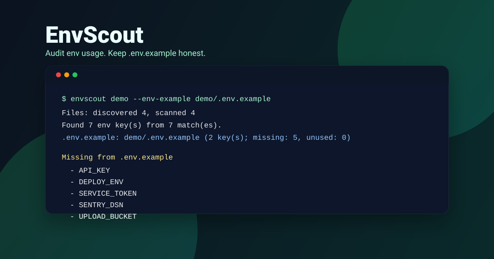

# EnvScout


EnvScout audits a codebase for **environment variable usage** (e.g. `process.env.API_KEY`, `os.environ["TOKEN"]`, `${DEPLOY_ENV}`) and checks whether your `.env.example` actually documents those keys.

It’s intentionally dependency-free and fast: a small, credible CLI you can skim in a single sitting.



## Highlights

- finds env usage across JS/TS, Python, YAML, and shell-style `${VARS}`
- reports **missing keys** (referenced in code but absent from `.env.example`)
- reports **unused keys** (present in `.env.example` but not referenced)
- optional `--autofix` appends missing keys to `.env.example` safely
- can export a polished standalone **HTML report** for PRs, docs, or audits
- exports **SARIF** for GitHub Code Scanning and CI quality gates
- supports a **baseline** so new projects can enforce only newly introduced drift
- ships with a small demo project + tests + CI

## Quick Start

Requirements: Node **20+**

Run on the included demo:

```bash
node src/cli.js demo --env-example demo/.env.example
```

Audit your current repo:

```bash
node src/cli.js . --env-example .env.example
```

Generate a Markdown report you can paste into an issue/PR:

```bash
node src/cli.js . --env-example .env.example --format markdown --output envscout-report.md
```

Generate a shareable HTML audit:

```bash
node src/cli.js . --env-example .env.example --format html --output envscout-report.html
```

Export findings for GitHub Code Scanning or another SARIF-aware platform:

```bash
node src/cli.js . --env-example .env.example --format sarif --output envscout.sarif
```

In GitHub Actions, upload the report with `github/codeql-action/upload-sarif` after running EnvScout. Missing keys are emitted as errors with source locations; stale example keys are emitted as warnings.

Append missing keys to `.env.example`:

```bash
node src/cli.js . --env-example .env.example --autofix
```

## Adopt incrementally with a baseline

For an existing project with known gaps, capture today’s missing keys once and commit the generated baseline. Future runs exit non-zero only when a new undocumented key is introduced. SARIF output also contains only new missing keys, keeping code-scanning alerts actionable.

```bash
# Capture current debt once (commit this file)
node src/cli.js . --write-baseline .envscout-baseline.json

# In CI, preserve the baseline while blocking new drift
node src/cli.js . --baseline .envscout-baseline.json --format sarif --output envscout.sarif
```

You can also set `"baseline": ".envscout-baseline.json"` in `.envscoutrc.json`.

## Config (Optional)

If a `.envscoutrc.json` exists in the target root, EnvScout loads it automatically:

```json
{
  "envExample": ".env.example",
  "baseline": ".envscout-baseline.json",
  "ignore": ["node_modules/", "dist/", "build/"]
}
```

CLI flags override config.

## Exit Codes

- `0` no missing keys
- `1` missing keys were found (actionable)
- `2` invalid usage / bad flags

## Project Structure

- `src/cli.js` - CLI entry point
- `src/scan.js` - file walking + pattern matching
- `src/patterns.js` - language patterns and scan heuristics
- `src/envExample.js` - `.env.example` parsing and `--autofix`
- `src/output.js` - table, Markdown, standalone HTML, and SARIF renderers
- `demo/` - tiny mixed-language demo project
- `test/` - Node built-in test runner suite
- `.github/workflows/ci.yml` - lightweight CI

## Future Ideas

- glob-based ignore patterns (instead of simple subpath matching)
- richer language support (Go, Rust, Java, Dockerfile `ARG`/`ENV` awareness)
- pre-commit hook mode for “fail fast” config drift

## License

MIT
